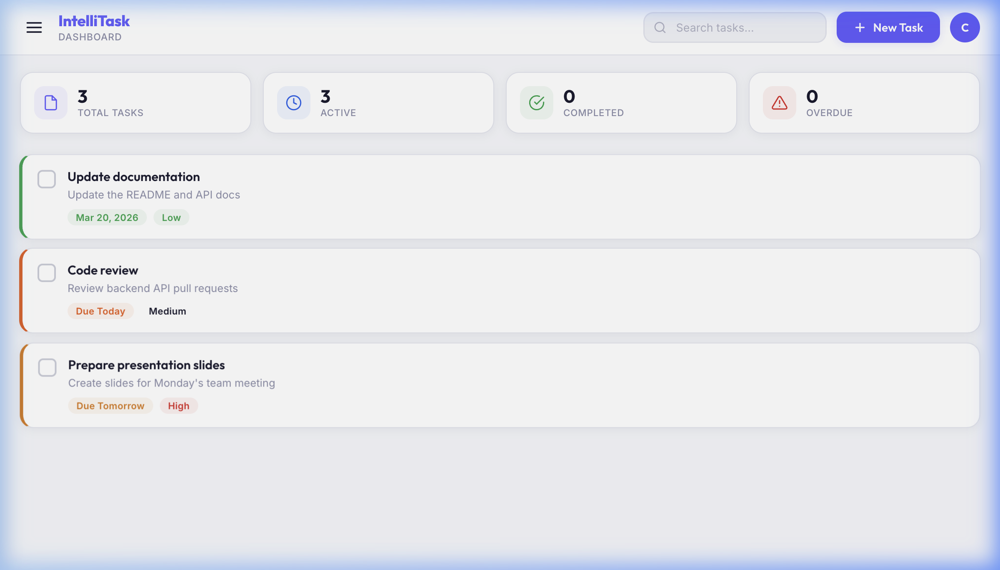
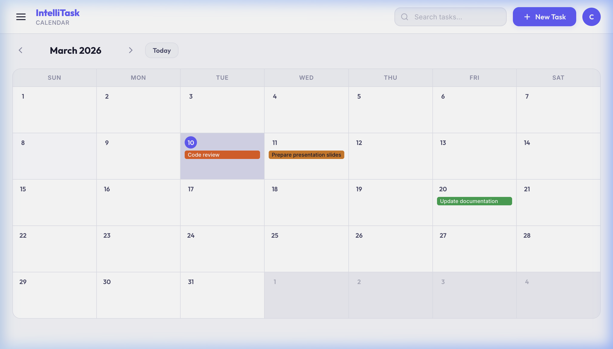

# IntelliTask — Smart Task Manager

IntelliTask is a modern, intuitive task management web application built entirely with HTML, CSS, and Vanilla JavaScript. It leverages client-side `localStorage` to save your data natively in the browser—no backend required.

##  Features

- **Modern Authentication:** Local signup, login, and password reset flows.
- **Dynamic Dashboard:** Get a quick overview of Total, Active, Completed, and Overdue tasks.
- **Smart Task Management:** Create, edit, delete, and mark tasks as complete.
- **Deadline Indicators:** Visual color-coded borders highlight tasks based on approaching deadlines (Due Today, Tomorrow, Overdue, etc.).
- **Calendar View:** A full monthly calendar to view tasks plotted visually on their due dates.
- **Categorization:** Separate active, completed, and overdue views.
- **Notifications:** Built-in toast reminders for approaching deadlines.
- **Theme Support:** Toggle seamlessly between clean Light Mode and sleek Dark Mode.

##  Screenshots






##  How to Run locally

Since there is no backend API or server setup required, getting started is extremely easy:

1. Clone the repository.
2. Open `index.html` directly in your browser, or start a local server, e.g.:
   ```bash
   npx serve .
   ```
3. Open `http://localhost:3000` (or your chosen port) in your browser.
4. Sign up for a local account, and start managing tasks!

##  Tech Stack

- **HTML5:** Semantic structure and layout.
- **CSS3:** Custom properties (CSS variables) for robust theming, Flexbox/Grid for layout, and animations.
- **Vanilla JavaScript:** DOM manipulation, form validation, date manipulation, and `localStorage` integration.

